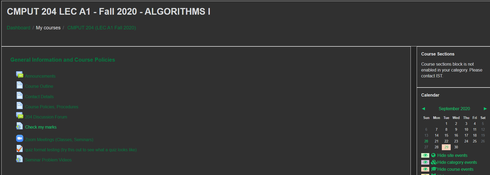
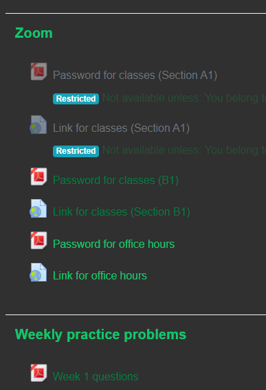
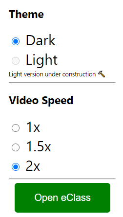
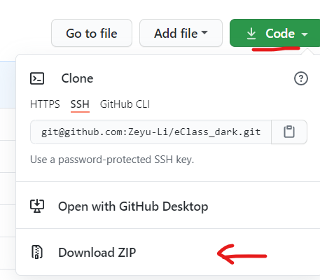

# eClass Dark

This Chrome extension will make eClass, a UofA class course website, thematically darker. In addition, there are quality of life changes such as

* Links will open on a new tab
* Video speed controls
* More visible text
* See what links have been visited
* Bigger Videos

Now available on Google chrome store: [chrome.google.com](https://chrome.google.com/webstore/detail/eclass-optimizations/dmnlhbobipheklaahbiopkhopglibcej)

## Preview

The links in lighter green show what has not been clicked

Extension options:

## Installing

To install this extension

1. Clone this GitHub repo or download zip

   

2. Unzip download (don't need to unzip if cloned)

3. Go to Chrome extension page by going to chrome://extensions/ (as a URL address)

4. Click Load unpacked and navigate to the unzipped folder (might require develop mode to be enabled)

5. Confirm

Now you have the extension installed!! 🤩

## License

MIT

## Bugs

If there are bugs, use the issues tab on GitHub (https://github.com/Zeyu-Li/eClass_dark/issues)

This extension should work with other Oracle's PeopleSoft programs will a bit of finagling 